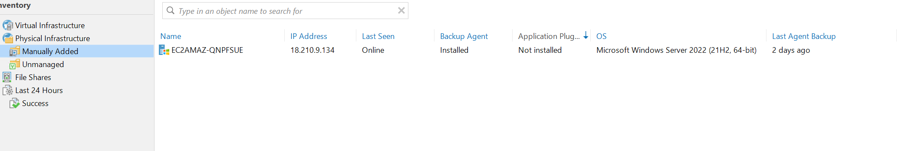

# Projekt TS für Dr. Med. Müller

## Übersicht 

Das Projekt TS für Dr. Med. Müller zielt darauf ab, eine zuverlässige und effiziente Backup- und Wiederherstellungsstrategie für den Terminal Server von Dr. Med. Müller zu implementieren. Die Sicherung und Wiederherstellung der Daten sind entscheidend, um einen reibungslosen Betrieb sowie den Schutz sensibler Informationen zu gewährleisten.

## Inhaltsverzeichnis

- [Projekt TS für Dr. Med. Müller](#projekt-ts-für-dr-med-müller)
  - [Übersicht](#übersicht)
  - [Inhaltsverzeichnis](#inhaltsverzeichnis)
  - [Planung](#planung)
    - [RAID 5 Konfiguration](#raid-5-konfiguration)
    - [AWS Cloud Konfiguration](#aws-cloud-konfiguration)
- [Backupserver-Konzept](#backupserver-konzept)
  - [Einleitung](#einleitung)
  - [Backup-Lösung](#backup-lösung)
    - [Veeam Vorteile](#veeam-vorteile)
  - [Systemanforderungen für Veeam](#systemanforderungen-für-veeam)
  - [Backupserver-Konfiguration](#backupserver-konfiguration)
  - [Backup-Strategie](#backup-strategie)
    - [Backup-Plan](#backup-plan)
    - [Strategische Überlegungen](#strategische-überlegungen)
  - [Restore-Prozess](#restore-prozess)
    - [Schritte meines Restore-Prozesses](#schritte-meines-restore-prozesses)
  - [Datensicherungskonzept](#datensicherungskonzept)
  - [Installation und Konfiguration](#installation-und-konfiguration)
  - [Veeam:](#veeam)
  - [Installation Probleme/Lösung](#installation-problemelösung)

## Planung

**Terminalserver Konzept:**  
Unser Terminalserver wird in einem anderen Netzwerk sein als der Backupserver. Die Entscheidung, den Terminalserver und den Backupserver in verschiedenen Netzwerken zu platzieren, dient der Sicherheit. Falls ein Netzwerk beeinträchtigt wird, bleibt das andere unberührt, was das Risiko von Datenverlust oder Betriebsunterbrechungen reduziert.

### RAID 5 Konfiguration
Um meinen Terminalserver für Herrn Müller in der AWS-Cloud einzurichten, plane ich eine RAID 5-Konfiguration auf dem Windows-Server, der speziell für seine Praxis betrieben wird. Dazu füge ich dem Server mehrere Amazon Elastic Block Store (EBS) Festplatten hinzu. Diese Festplatten werde ich dann in Windows so konfigurieren, dass sie zusammen als ein RAID 5-System arbeiten.

Durch die Einrichtung von RAID 5 werden die Daten von Herrn Müllers Praxis auf mehrere Festplatten verteilt, wobei Paritätsinformationen genutzt werden, um die Datenintegrität zu sichern. Falls eine der Festplatten ausfallen sollte, ermöglicht es mir diese Konfiguration, alle Daten ohne Verlust wiederherzustellen. Diese Methode bietet eine wichtige Sicherheitsebene für die sensiblen Patientendaten, die auf dem Terminalserver gespeichert sind.

### AWS Cloud Konfiguration
Da Herr Müller sein neues Netzwerk in der Cloud aufbauen möchte, werden wir den Terminalserver in der AWS Cloud konfigurieren. AWS ist kostengünstig und relativ leicht zu bedienen.

Folgende Anforderungen werden wir dort konfigurieren:
- IP-Adresse: 18.210.9.134 (Öffentlich für den SSH Zugriff)
- Subnetz: 172.31.120.0/28
- Instance-Typ: t2.large (8Gb Ram und 2 vCPUs)
- OS: Windows 2022 Server
- Port: SSH(22) RDP(3389)

# Backupserver-Konzept

## Einleitung
Der Backupserver ist das wichtigste bei unserem Projekt, da er die Grundlage für die Datensicherheit bildet. Durch regelmäßige automatisierte Backups gewährleistet er die Verfügbarkeit und Integrität unserer Daten. Im Falle eines Ausfalls oder einer Störung des Terminalservers ermöglicht der Backupserver eine schnelle Wiederherstellung, minimiert potenziellen Datenverlust und sorgt für eine kontinuierliche Geschäftskontinuität. Eine zuverlässige Backupstrategie ist daher essenziell für die Stabilität und Sicherheit unserer gesamten IT-Infrastruktur.

## Backup-Lösung
Für das Backup werden wir Veeam verwenden.

### Veeam Vorteile
- Schnelle Wiederherstellung
- Automatisierung und Planung
- Cloud-Integration
- Monitoring und Reporting
- Replikation für Hochverfügbarkeit
- SSH

## Systemanforderungen für Veeam
Min Windows Server 2016 und min 2Gb Speicher frei für die Installation.

## Backupserver-Konfiguration
Auf den folgenden Angaben bauen wir unseren Backupserver auf:
- IP-Adresse: 44.219.232.33
- Subnetz: 172.31.48.0/20
- Instance-Typ: t2.large (8Gb Ram und 2 vCPUs)
- OS: Windows 2022 Server
- Port: SSH(22) RDP(3389)

## Backup-Strategie
### Backup-Plan
| Backup-Typ          | Zeitplan            | Zweck/Beschreibung                                       |
|---------------------|---------------------|----------------------------------------------------------|
| Full Backup         | Donnerstag 22:00 Uhr| Wöchentliches vollständiges Backup außerhalb der Geschäftszeiten. |
| Full Backup         | Sonntag 22:00 Uhr   | Wochenend-Backup für zusätzliche Sicherheit und Datenintegrität.  |
| Inkrementelles Backup | Montag 22:00 Uhr    | Regelmäßige Datensicherung zu Beginn der Woche.          |
| Inkrementelles Backup | Dienstag 22:00 Uhr  | Datensicherung zur Mitte der Woche.                       |
| Inkrementelles Backup | Mittwoch 22:00 Uhr  | Sicherung vor dem wöchentlichen Full Backup.              |
| Inkrementelles Backup | Freitag 22:00 Uhr   | Abschluss der Arbeitswoche mit Datensicherung.            |

### Strategische Überlegungen
In der Praxis von Herrn Müller habe ich mich für eine spezifische Strategie für die Datensicherung entschieden, um den Schutz wichtiger Unternehmensdaten zu gewährleisten:

Für die **Backup-Benachrichtigungen** haben ich mich entschieden, eine Gmail-App zu verwenden und diese in Veeam zu integrieren. Dadurch können wir automatische E-Mail-Benachrichtigungen über den Status unserer Backups erhalten. Die Einrichtung ist unkompliziert: Wir erstellen eine Gmail-App, konfigurieren die SMTP-Einstellungen in Veeam mit den Anmeldeinformationen der Gmail-App und führen einen Test durch, um die Funktionalität zu gewährleisten. Mit dieser Lösung können wir den Backup-Status effektiv überwachen.

Um die Sicherheit der Backup-Daten zu erhöhen, habe ich entschieden, alle Backups zu verschlüsseln. Diese **Verschlüsselung** realisiere ich in Veeam unter Verwendung eines starken, sicheren Passworts. Dadurch stelle ich sicher, dass die Daten auch im Falle eines unbefugten Zugriffs geschützt sind

Hier die Berrechnung von den beiden Server was das alles bei AWS Kosten würde:

## Restore-Prozess
Ich habe einen genauen Restore-Prozess in Veeam entwickelt, der folgende Schritte umfasst:

### Schritte meines Restore-Prozesses

1. **Überprüfung des Backup-Status**
   - Ich öffne die Veeam Backup & Replication Konsole.
   - Im Abschnitt „Backups“ überprüfe ich den Status der letzten Backups und stelle sicher, dass sie erfolgreich abgeschlossen wurden.

2. **Auswahl des Wiederherstellungspunktes**
   - Ich wähle das gewünschte Backup aus und klicke auf „Restore“.
   - Je nach Bedarf wähle ich „Entire VM restore“ für eine vollständige VM-Wiederherstellung oder „Guest files restore“ für spezifische Dateien.

3. **Vorbereitung des Restore-Jobs**
   - Im Restore-Assistenten wähle ich den spezifischen Wiederherstellungspunkt basierend auf Datum und Uhrzeit.
   - Ich bestätige die Auswahl der VM oder Dateien, die wiederhergestellt werden sollen.

4. **Durchführung der Wiederherstellung**
   - Ich wähle das Ziel für die Wiederherstellung, entweder den ursprünglichen Standort oder einen neuen Standort.
   - Nach der Überprüfung der Einstellungen starte ich den Wiederherstellungsprozess.

5. **Überprüfung nach der Wiederherstellung**
   - Nach Abschluss überprüfe ich, ob die VM oder Dateien korrekt wiederhergestellt wurden.
   - Ich teste die Funktionalität, um sicherzustellen, dass alles ordnungsgemäß funktioniert.

6. **Dokumentation und Reporting**
   - Ich dokumentiere jeden Schritt des Prozesses, einschließlich der Auswahl des Wiederherstellungspunktes.
   - Mit der „Reports“-Funktion in Veeam generiere ich einen Bericht über den Restore-Job.

Durch die Befolgung dieses Prozesses stelle ich sicher, dass die Wiederherstellung präzise und zuverlässig erfolgt, minimiere das Risiko von Datenverlusten und gewährleiste die Integrität unserer Systeme.

## Datensicherungskonzept

## Installation und Konfiguration

**AWS**
Die Konfiguration in AWS ist relativ simpel. Im Bereich VPC konfiguriere ich unsere zwei Subnetze wie geplant. Um sicherzustellen, dass unsere zwei Instanzen dauerhaft erreichbar sind und nicht ständig die IP-Adresse ändern, richte ich sogenannte Elastic IPs in AWS ein. Diese weise ich später den beiden Servern zu. Nun kann ich unsere Server einrichten. Dafür klicke ich auf "Instances starten", benenne unsere Server und wähle den Windows 2022 Server aus. Als Instanztyp wähle ich, wie zuvor beschrieben, t2.large. Beim Schlüsselpaar greife ich auf SSH-1 zurück, das ich bereits erstellt hatte. In den Netzwerkeinstellungen erstelle ich eine neue Sicherheitsgruppe und konfiguriere sie folgendermaßen:

TCP Port 22 (SSH)
TCP Port 3389 (RDP)
TCP Port 443 (HTTPS)
TCP Port 9401 (Veeam Backup Service)
Für den Speicher brauche ich nichts zu konfigurieren, da das Hinzufügen von Festplatten im laufenden Betrieb einer der Vorteile der Cloud ist. Anschließend weise ich unseren Servern die Festplatten zu, und wir sind bereit für die Windows-Konfiguration.

**Windows Konfiguration**

Die Konfiguration von Windows und des Backups ist das Herzstück unseres Projekts. Daher erkläre ich hier jeden Schritt genau.
**RAID 5 Einrichtung:**

Um ein RAID 5-Array in Windows mit drei 52-GB-Festplatten zu konfigurieren, öffne ich zuerst die Datenträgerverwaltung, indem ich mit der rechten Maustaste auf das Startmenü klicke und "Datenträgerverwaltung" auswähle. Hier sehe ich alle angeschlossenen Laufwerke. Da RAID 5 mindestens drei Festplatten erfordert, stelle ich sicher, dass meine drei 52-GB-Festplatten erkannt werden und als "Nicht zugeordnet" aufgeführt sind.

Als Nächstes konvertiere ich jede der drei Festplatten in dynamische Datenträger, indem ich mit der rechten Maustaste darauf klicke und "Datenträger in dynamischen Datenträger konvertieren" auswähle. Nachdem alle Festplatten zu dynamischen Datenträgern konvertiert wurden, erstelle ich das RAID 5-Volume, indem ich mit der rechten Maustaste auf einen der dynamischen Datenträger klicke und "Neues RAID-5-Volume erstellen" auswähle. Ich folge den Anweisungen des Assistenten, füge alle drei Festplatten zum Volume hinzu und konfiguriere es, einschließlich der Zuweisung eines Laufwerkbuchstabens und der Formatierung des Volumes mit dem Dateisystem NTFS.

**Nettime:**

Um die Zeitsynchronisation in Dr. med. Müllers Praxis sicherzustellen, installiere ich NetTime auf dem Terminalserver und dem Backupserver. Dies garantiert, dass alle Systeme synchron laufen, was für die Konsistenz von Patientendaten und das Timing der Backups kritisch ist.

Ich beginne mit dem Download der neuesten NetTime-Version von der offiziellen Webseite, die kompatibel mit unseren Windows-Servern ist. Die Installation führe ich auf beiden Servern durch, indem ich die heruntergeladene Datei als Administrator ausführe. Nach dem Akzeptieren der Lizenzvereinbarung und der Auswahl des Installationspfades schließe ich die Installation ab und führe einen Neustart der Systeme durch.

Nach dem Neustart überprüfe ich, ob NetTime läuft und die Zeit mit einem verlässlichen Zeitserver synchronisiert. Diese Schritte stellen sicher, dass sowohl der Terminal- als auch der Backupserver von Dr. Müller stets die genaue Zeit verwenden, was für die Präzision in der Datenverarbeitung und Sicherung unerlässlich ist.
## Veeam:
Die Installation von Veeam ist grundsätzlich einfach gestaltet, dennoch bin ich auf einige Probleme gestoßen. Mehr dazu später.

Um Veeam zu Installieren bin ich wieder auf die Offiziele seite gegangen, um dort das Offiziele File Herunterladen zu können. Sobald dies Heruntergeladen wurde konnte ich das ISO File öffnen. Anschliessend konnte ich beim ISO Laufwerk dass Veeam Setup ausführen.
Dannach haben wir 3 Optionen:

Veeam Backup & Replication Installieren: Diese Option wählte ich, um die vollständige Veeam Backup & Replication-Lösung auf meinem Server zu installieren. Sie umfasst alle notwendigen Komponenten für das Backup und die Wiederherstellung von virtuellen, physischen und Cloud-basierten Workloads.

Veeam ONE Installieren: Veeam ONE bietet erweiterte Überwachungs- und Reporting-Funktionen für Backup-Infrastrukturen. Es handelt sich um eine separate Komponente, die für umfassende Einblicke und Analysen in die Backup-Umgebung sorgt. Obwohl es für die grundlegende Backup- und Wiederherstellungsfunktion nicht zwingend erforderlich ist, kann es wertvolle Informationen zur Leistung und Gesundheit der Backup-Infrastruktur liefern.

Veeam Backup & Replication Konsole Installieren: Die Installation der reinen Management-Konsole wäre eine Option gewesen, wenn ich die zentralisierte Verwaltung der Veeam-Infrastruktur von einem separaten Arbeitsplatz aus planen wollte, ohne die vollständige Veeam Backup & Replication Suite auf diesem System zu installieren. Diese Option ist besonders nützlich, wenn Administratoren von verschiedenen Standorten aus auf die Backup-Umgebung zugreifen müssen.
Für die Bedürfnisse der Praxis von Dr. med. Müller und um eine direkte und effiziente Verwaltung der Backups sicherzustellen, entschied ich mich für die erste Option: die vollständige Installation von Veeam Backup & Replication. Diese Wahl stellte sicher, dass ich Zugriff auf alle erforderlichen Tools für das Backup-Management direkt auf dem Backupserver hatte, was die Konfiguration und Überwachung der Backup-Jobs erleichtert.

Nachdem ich die Installationsroutine von Veeam Backup & Replication gestartet hatte, stand ich vor der Entscheidung, ein Ziel für die Backup-Daten zu wählen. Für die optimale Nutzung der verfügbaren Ressourcen und zur Gewährleistung der Datensicherheit entschied ich mich, das RAID 5-Laufwerk als Speicherort für die Backups zu verwenden. Dieses Laufwerk bietet dank seiner Konfiguration eine gute Balance zwischen Speicherkapazität und Datensicherheit.
Bezüglich der Lizenzierung von Veeam Backup & Replication stellte ich fest, dass für die aktuelle Konfiguration der Praxis keine Lizenz erforderlich ist. Veeam bietet eine Community Edition an, die für kleinere Umgebungen oder für eine begrenzte Anzahl von Workloads kostenlos genutzt werden kann. Da in Dr. med. Müllers Praxis weniger als 10 PCs in die Backup-Strategie einbezogen werden müssen, fiel die Entscheidung auf die Nutzung dieser kostenfreien Version.

Nachdem Veeam Backup & Replication erfolgreich Heruntergeladen ist, können wir mit der Konfiguration beginnen.

**Server Hinzufügen**
In Veeam Backup & Replication öffnete ich den Bereich „Backup Infrastructure“ und wählte „Add Backup Repository“. Im Assistenten entschied ich mich für den Speichertyp, der am besten zu meiner Konfiguration passt, basierend auf dem Speichermedium, das ich für die Backups nutzen wollte. Ich gab dem Repository einen eindeutigen Namen, der es mir erlaubt, es leicht zu identifizieren, z.B. „Backup Repository Dr. Müller“. Dann wies ich dem Repository einen Speicherort zu, in diesem Fall das RAID 5-Laufwerk, das ich bereits eingerichtet hatte, um eine hohe Datensicherheit und Ausfallsicherheit für die Backups zu gewährleisten. Nachdem ich den Speicherpfad ausgewählt und die Größe des Repositories festgelegt hatte, überprüfte Veeam die Konfiguration. Mit einem Klick auf „Finish“ schloss ich den Vorgang ab, und das neue Backup Repository war erfolgreich hinzugefügt und bereit für die Sicherung der Daten.

Das sieht nachher wie folgt aus:

Wichtig ist dabei das man einen Rescan macht. Dann sieht man nähmlich ob alle Ports offen sind und der Terminalserver erreichbar ist. Nicht das dies nachher Probleme gibt.

**Backup Job einrichten**

im veeam backup & replication habe ich auf "home" geklickt und dann "new agent backup job" ausgewählt. als job-modus habe ich "server" ausgewählt, da die ip-adresse 18.210.9.134 zu dem server von dr. müller gehört. im nächsten schritt habe ich auf "add computer" geklickt und die ip-adresse 18.210.9.134 eingetragen. dabei habe ich die administrator-anmeldeinformationen verwendet, die ich zuvor eingerichtet hatte. als backup-modus habe ich "managed by backup server" gewählt, sodass der backup-server die planung und durchführung der backups steuert. für den speicherort der backups habe ich das raid 5-laufwerk ausgewählt, das als backup-repository konfiguriert ist. unter "guest processing" habe ich die optionen für die verarbeitung auf dem gastbetriebssystem eingestellt. danach habe ich die zeitplanung für die backups festgelegt. ich habe entschieden, dass die backups täglich um 22:00 uhr stattfinden sollen. nachdem alle einstellungen konfiguriert waren, habe ich auf "apply" geklickt und den job gestartet, um sicherzustellen, dass alles korrekt funktioniert. abschließend habe ich die konfiguration und den status der backups überprüft, um sicherzustellen, dass alles wie geplant läuft.

Um da ganze nun zu testen können wir nun auf Jobs gehen und dort den TS auswählen. Start klicken und dann wird das ganze schon getestet.

## Installation Probleme/Lösung

In meiner Veeam Backup & Replication Installation stieß ich auf ein Problem, das eine Neuausrichtung der Versionskompatibilität zwischen dem Veeam Backup Server und dem Veeam Data Mover Service erforderte. Die Fehlermeldung zeigte an, dass die Version des Backup-Servers (12.0.0.1420) nicht mit der Version des Veeam Data Mover Service (12.0.1.2131) auf dem Host übereinstimmte.

Ein manuelles Update war in dieser Situation nicht möglich. Daher entschied ich mich, Veeam Backup & Replication vollständig neu zu installieren, um sicherzustellen, dass beide Komponenten – der Server und der Data Mover Service – die gleiche Version aufweisen. Dies war ein entscheidender Schritt, um die Integrität und Funktionsfähigkeit des Backup-Systems zu gewährleisten und um weitere Komplikationen oder Inkompatibilitäten zu vermeiden.

Nachdem ich Veeam Backup & Replication deinstalliert hatte, führte ich einen Neustart des Servers durch und installierte die Software erneut, diesmal darauf achtend, dass ich die korrekte und aktuellste Version von der offiziellen Veeam-Website herunterlud. Nach Abschluss der Neuinstallation überprüfte ich die Versionen beider Komponenten, um sicherzustellen, dass sie übereinstimmten und kompatibel waren.

Die erneute Installation löste das Problem erfolgreich, und ich konnte den Backup-Job ohne weitere Fehlermeldungen durchführen. Abschließend führte ich einen Testlauf durch, um die Funktionalität des Backups zu überprüfen und sicherzustellen, dass alle Komponenten korrekt zusammenarbeiteten. Diese Lösung stellte die vollständige Funktionsfähigkeit der Backup-Lösung für Dr. med. Müllers Praxis wieder her und sorgte dafür, dass die Patientendaten sicher und zuverlässig gesichert wurden.

